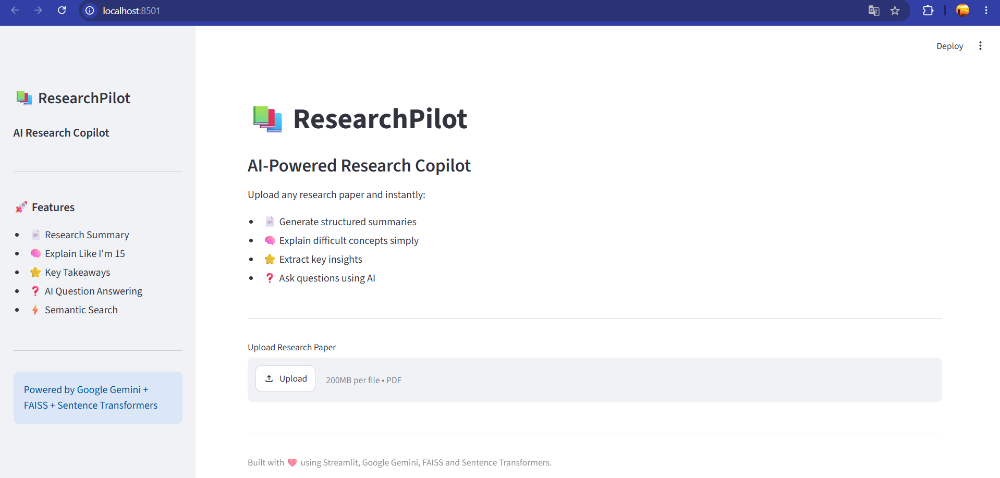
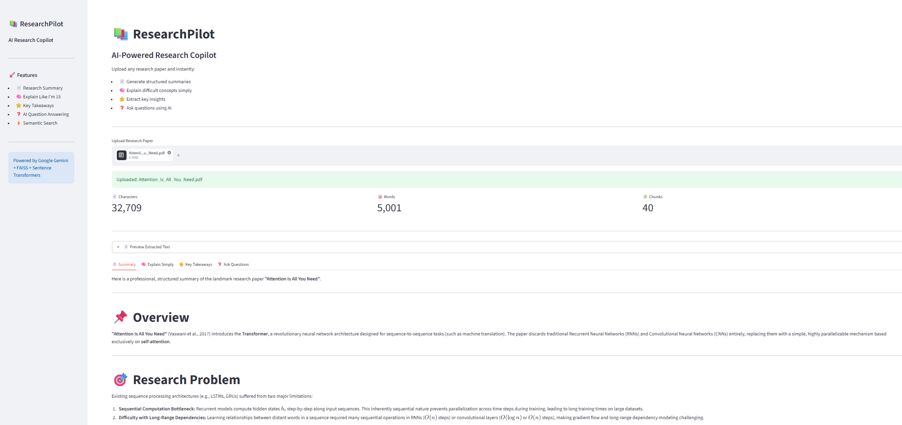
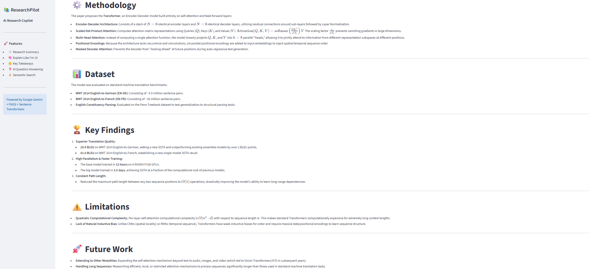
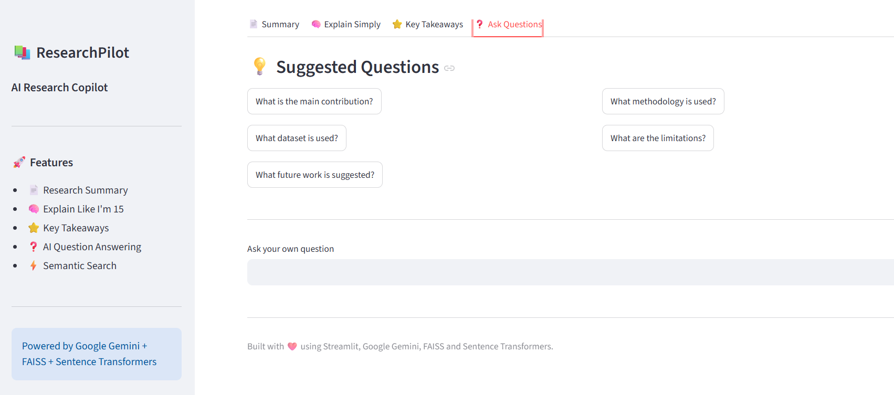

# 📚 ResearchPilot

> AI-Powered Research Copilot for Reading, Understanding, and Exploring Research Papers.


---

## 🚀 Live Demo

**Live App:** https://researchpilotai-5mpt3dszq2nbj8wbp3um8d.streamlit.app/

**GitHub:** https://github.com/NIKHILnitr/Research_Pilot_AI

## 🚀 Overview

ResearchPilot is an AI-powered assistant that helps users quickly understand research papers.

Simply upload a PDF and the application automatically:

- 📄 Generates a structured summary
- 🧠 Explains the paper in simple language
- ⭐ Extracts key takeaways
- ❓ Answers questions using Retrieval-Augmented Generation (RAG)

---

## ✨ Features

- 📄 AI-generated research summaries
- 🧠 Explain research in simple language
- ⭐ Key takeaways extraction
- ❓ Ask questions about the paper
- 🔍 Semantic search using FAISS
- 📥 Download AI summary
- 📊 Paper statistics
- ⚡ Fast PDF processing

---

## 🛠 Tech Stack

### Frontend

- Streamlit

### AI

- Google Gemini
- Sentence Transformers

### Vector Search

- FAISS

### PDF Processing

- PyMuPDF (fitz)

### Language

- Python

---

## 📂 Project Structure

```text
ResearchPilot/
│
├── sample_papers/
│   └── (Sample research PDFs)
│
├── utils/
│   ├── pdf_loader.py
│   ├── summarizer.py
│   └── vector_store.py
│
├── venv/                  
├── .env                  
├── .gitignore
├── app.py
├── README.md
├── requirements.txt
│
├── image.png
├── image-1.png
├── image-2.png
├── image-3.png
└── image-4.png
```

---

## ⚙️ Installation

Clone the repository

```bash
git clone https://github.com/NIKHILnitr/Research_Pilot
```

Move into the project

```bash
cd ResearchPilot
```

Create virtual environment

```bash
python -m venv venv
```

Activate

Windows

```bash
venv\Scripts\activate
```

Linux / Mac

```bash
source venv/bin/activate
```

Install dependencies

```bash
pip install -r requirements.txt
```

Create a `.env` file

```
GEMINI_API_KEY=YOUR_API_KEY
```

Run

```bash
streamlit run app.py
```

---

## 📸 Screenshots

### Home



### Summary



### Question Answering



---

## 🚀 Future Improvements

- Compare two research papers
- Citation generation
- Research paper recommendations
- Multi-PDF chat
- Save conversation history

---

## 👨‍💻 Author

**Nikhil Bhoi**

GitHub:
https://github.com/NIKHILnitr

LinkedIn:
https://www.linkedin.com/in/nikhilbhoi/

---

## 📜 License

MIT License
